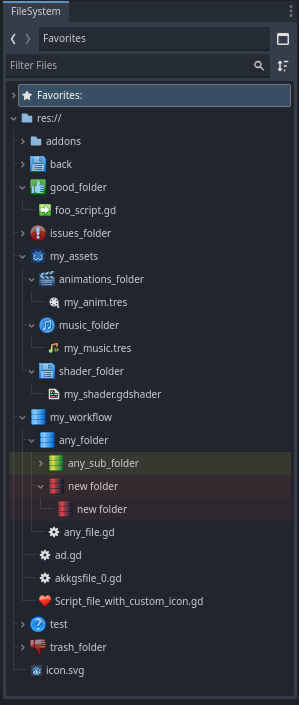

# Fancy-Folder-Icons

Custom Folder Icons Addon For Godot 4

Allows you to choose a custom icons for folders. _(also works with files)_

  

# How Work

In the godot file system, press RMB (right click) on any folder/file you want to **iconize** and select **Custom Icon** from the menu.

### File System Preview

### Menu Preview

# Special Thanks 📜

This section lists users who have contributed to improving the quality of this project.

[@Lerpwave](https://github.com/Lerpwave)

#

Copyrights (c) CodeNameTwister. See [LICENSE](LICENSE) for details.

[godot engine]: https://godotengine.org/

instead of having to set a custom icon for each folder indevidually, the folders will be set using rules.

### Rules instructions

for match rules you can have the path be matched my string, or \* for wildcard which matches any folder, or \*\* for wildcard that matches any amount of folders in a row.

rules can be changed at project settings plugin/fancy_folder_icons/rules

## eg:

- match rule "res://scenes/blocks/\*\*/images/"
  - matches "res://scenes/blocks/block1/images/"
  - matches "res://scenes/blocks/block2/images/"
  - matches "res://scenes/blocks/block3/nested_folder/images/"
  - matches "res://scenes/blocks/block3/nested_folder/nested_folder2/images/"

---

- replace rule "res://scenes/blocks/image.png"
  - loads image from "res://scenes/blocks/image.png"

---

- match rule "res://scenes/blocks/\*\*/images/"
- replace rule "res://scenes/blocks/$1/images/editorBar.png||res://scenes/blocks/$1/images/1.png||res://scenes/blocks/$1/images/unpressed.png||res://scenes/blocks/$1/images/ghost.png"
  - when match rule matches "res://scenes/blocks/block1/images/"
  - tries to load image from "res://scenes/blocks/block1/images/editorBar.png"
  - if not successful tries to load image from "res://scenes/blocks/block1/images/1.png"
  - if not successful tries to load image from "res://scenes/blocks/block1/images/unpressed.png"
  - if not successful tries to load image from "res://scenes/blocks/block1/images/ghost.png"
  - if not successful logs an error

---

if one replace rule fails, if the file is not found, to match the errors are saved and only shown if no later replace rules match.

## settings

- textureAppliesToNestedFolders

## todo

- add support for more than one \*\* per match rule
- add support for test\* to mean folder starting with test
