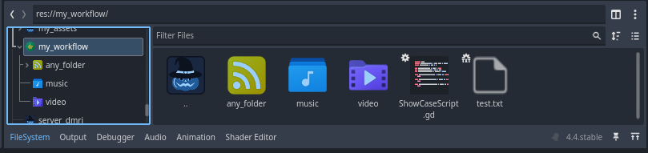
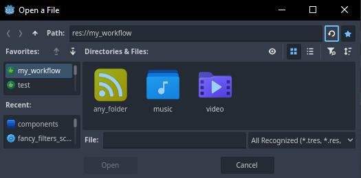

# Fancy-Folder-Icons
Custom Folder Icons Addon For Godot 4

Allows you to choose a custom icons for folders. *(also works with files)*

  

# How Work
In the godot file system, press RMB (right click) on any folder/file you want to **iconize** and select **Custom Icon** from the menu.

### File System Preview

### File System In Bottom (Split Mode)

### Open File Panel

### Menu Preview

# Special Thanks 📜 
This section lists users who have contributed to improving the quality of this project.

[@Lerpwave](https://github.com/Lerpwave)

#

Copyrights (c) CodeNameTwister. See [LICENSE](LICENSE) for details.

[godot engine]: https://godotengine.org/
